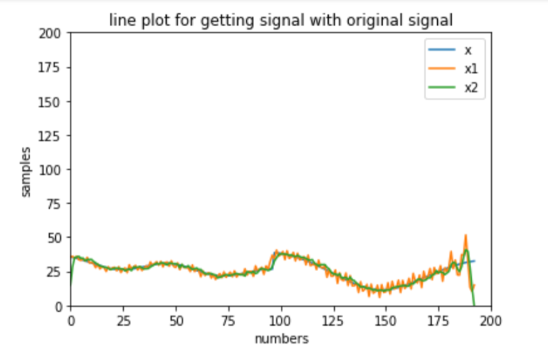

# EEL2010 Programming Assignment 

## Problem Statement
-------------------------------------------------
One of the many applications of Internet of Things (IoT) consists of continuous monitoring of temperature
in an area. To that end, several temperature sensors are installed at different locations. These sensors
measure and store the recorded value of temperature over time. However, due to limitations of hardware,
the sensor memory needs to be cleared periodically and this is done by transmitting the stored values to
a base unit. Assume that x[n] denotes the samples of the true value of temperature recorded by a sensor.
However, it is found that the received signal y[n] at the base unit suffers from blur distortions and noise
(additive). Hence, the signal y[n] needs to be first processed so that we can recover x[n] from it. Assume
that blur happens via a system characterized an impulse response h[n] = 1/16 [1, 4, 6, 4, 1] (assume
that the center value of 6/16 corresponds to n = 0). Then, implement the following two approaches to recover the original signal x[n] from distorted signal y[n].

1. First remove noise and then sharpen (deblur). Let the resulting signal be x1[n].
2. First sharpen (deblur) and then remove noise. Let the resulting signal be x2[n].

Now, compare x1[n] and x2[n] with x[n]. What conclusions can you draw from your observations? Also,
explain your observations from a theoretical perspective if possible.

## Solution Explaination
-------------------------------------------------
Applied principles learned from the course, Signals and systems such as Fourier Transform , Inverse Tramsform, Denoising, Debrurring, Sampling, etc.

We both firstly make a rough picture of what we have to actually do.
After that we had taken the data frame of x[n] and y[n] with the help of pandas library and made a separate array for the values of x[n] and y[n].
Then we wrote the code to make the function  for denoising of signal ,fourier  transform of signal and  inverse transform of signal .
After getting the Fourier transform we had done sampling of the y[n] signal .

For better understanding between the x1[n], x2[n] and x[n], we wrote the code to line plot of the signal with the help of matplotlib library and labeled that.

Detailed explaination can be veiwed from the given goole document [link](https://docs.google.com/document/d/1FNoCyNTeCOwkKxSuyrCozl6FUmC1Eaz1QbYqLb2Opig/edit?usp=sharing).

## Data
-------------------------------------------------
Data can be found at the given [link](https://drive.google.com/file/d/1yvZ8cZ83NU-DPmZAFs_Z3KXrCriNEyar/view?usp=sharing)
 in data.csv file.
Data consist of two coloumns of x[n] and y[n].

## How to run code!
-------------------------------------------------
Code is avalable at the given [link](https://colab.research.google.com/drive/10XjJQy43OKU6m4P4FqcB433vy8-pwnEy?usp=sharing) of google colab file named as EEL2010_PA_Code.

Nothing is needed to be pre-installed to run the code.

Go to google colab through the above link.

Then run the first cell, here you need to authorizated
via URL in a browser which will appear after running first cell, then you need to copy the security code from there and paste that in the block asking for it in google colab.This step is done to mount data stored in your drive to google colab.

And you need to modify path of data according to the location of it in your drive. 

Now you can smoothly run the rest of the cells. Code working is instructed there in comment statements.  

## Modules Required
-------------------------------------------------
pandas --> To deal with dataframe.

numpy and math --> For performing calculations and to deal with array.

matplotlib --> For visualizing output through plots.

## Result and Conclusion
-------------------------------------------------
Can be veiwed from given [link](https://docs.google.com/document/d/1FNoCyNTeCOwkKxSuyrCozl6FUmC1Eaz1QbYqLb2Opig/edit?usp=sharing).

## Team members
-------------------------------------------------

Aditi Tiwari (B20EE005)

Shreya Sachan (B20EE065)
